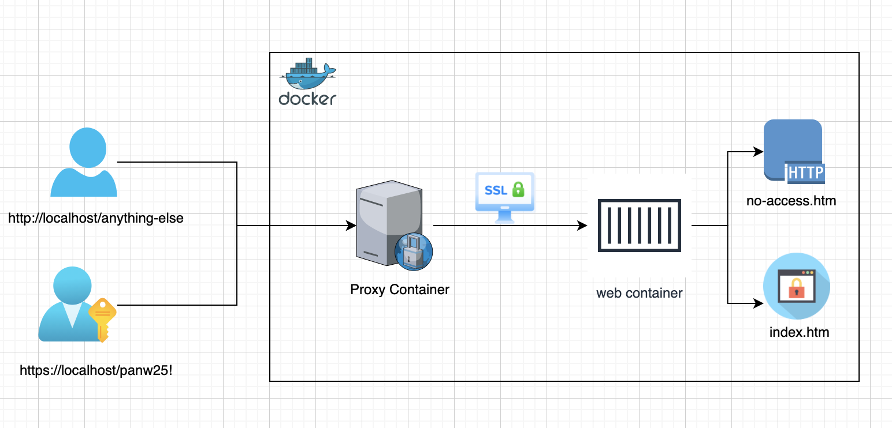

## Tech Task

This repo contains the results of the following challenge:

```
“I need a small web app (a single HTML page) to be available online. 
The webpage content is confidential so I need it to be secured with 
Basic authentication over TLS. I also would like to support a secret 
token within the URL as a second authentication factor. I would like 
all the security verification to take place in a separate container 
before reaching the container that hosts the confidential content. 
I need to be able to build the entire solution from Dockerfiles 
and deploy it via Docker Compose.

Please include the credentials in the documentation you provide (username 
and password of your choice). The content should be available at 
https://<host:port>/<some static token here>/index.htm” where the token 
is any “key” you choose that should be included in the documentation you 
provide.
```
## Architecture Diagram
    

## Repository Contents
```

├── README.md
├── docker-compose.yml
├── proxy
│   ├── Dockerfile
│   ├── certs
│   │   ├── server.crt
│   │   ├── server.csr
│   │   ├── server.key
│   │   └── server.pem
│   ├── haproxy.cfg
│   ├── haproxy_start.sh
│   └── no-access.htm
└── web
    ├── Dockerfile
    ├── conf
    │   └── nginx.conf
    └── content
        └── index.htm
```

## How to Run 
```
> docker build web
> docker build proxy
> docker compose up
```
